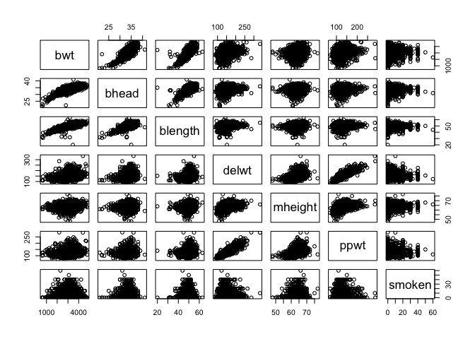

Homework 6
================
Alyssa Vanderbeek
27 November 2018

### Problem 1

``` r
homicide_data = read_csv('./data/problem1/homicide-data.csv') # read in data
```

    ## Parsed with column specification:
    ## cols(
    ##   uid = col_character(),
    ##   reported_date = col_integer(),
    ##   victim_last = col_character(),
    ##   victim_first = col_character(),
    ##   victim_race = col_character(),
    ##   victim_age = col_character(),
    ##   victim_sex = col_character(),
    ##   city = col_character(),
    ##   state = col_character(),
    ##   lat = col_double(),
    ##   lon = col_double(),
    ##   disposition = col_character()
    ## )

``` r
homicide_data_tidy = homicide_data %>%
  mutate(city_state = paste(city, toupper(state), sep = ', '), # create city_state variable
         victim_race = fct_relevel(ifelse(victim_race == 'White', 'white', 'non-white'), 'white'), # dichotomize race as factor (white vs. non-white)
         victim_age = ifelse(victim_age == 'Unknown', NA, as.numeric(victim_age)), # make age numeric
         resolved = as.numeric(disposition == "Closed by arrest")) %>% # create binary variable for whether murder is resolved
  filter(!(city_state %in% c('Tulsa, AL', 'Dallas, TX', 'Phoenix, AZ', 'Kansas City, MO'))) # filter cities
```

    ## Warning in ifelse(victim_age == "Unknown", NA, as.numeric(victim_age)): NAs
    ## introduced by coercion

``` r
str(homicide_data_tidy)
```

    ## Classes 'tbl_df', 'tbl' and 'data.frame':    48507 obs. of  14 variables:
    ##  $ uid          : chr  "Alb-000001" "Alb-000002" "Alb-000003" "Alb-000004" ...
    ##  $ reported_date: int  20100504 20100216 20100601 20100101 20100102 20100126 20100127 20100127 20100130 20100210 ...
    ##  $ victim_last  : chr  "GARCIA" "MONTOYA" "SATTERFIELD" "MENDIOLA" ...
    ##  $ victim_first : chr  "JUAN" "CAMERON" "VIVIANA" "CARLOS" ...
    ##  $ victim_race  : Factor w/ 2 levels "white","non-white": 2 2 1 2 1 1 2 2 1 2 ...
    ##  $ victim_age   : num  78 17 15 32 72 91 52 52 56 43 ...
    ##  $ victim_sex   : chr  "Male" "Male" "Female" "Male" ...
    ##  $ city         : chr  "Albuquerque" "Albuquerque" "Albuquerque" "Albuquerque" ...
    ##  $ state        : chr  "NM" "NM" "NM" "NM" ...
    ##  $ lat          : num  35.1 35.1 35.1 35.1 35.1 ...
    ##  $ lon          : num  -107 -107 -107 -107 -107 ...
    ##  $ disposition  : chr  "Closed without arrest" "Closed by arrest" "Closed without arrest" "Closed by arrest" ...
    ##  $ city_state   : chr  "Albuquerque, NM" "Albuquerque, NM" "Albuquerque, NM" "Albuquerque, NM" ...
    ##  $ resolved     : num  0 1 0 1 0 0 1 1 0 0 ...

``` r
# Logistic regression for all cities
fit_logistic = homicide_data_tidy %>%
  glm(resolved ~ victim_age + victim_race + victim_sex, data = ., family = binomial())

summary(fit_logistic)
```

    ## 
    ## Call:
    ## glm(formula = resolved ~ victim_age + victim_race + victim_sex, 
    ##     family = binomial(), data = .)
    ## 
    ## Deviance Residuals: 
    ##    Min      1Q  Median      3Q     Max  
    ## -1.594  -1.101  -1.080   1.254   1.306  
    ## 
    ## Coefficients:
    ##                        Estimate Std. Error z value Pr(>|z|)    
    ## (Intercept)           0.9399017  0.0425156  22.107  < 2e-16 ***
    ## victim_age           -0.0014748  0.0006581  -2.241    0.025 *  
    ## victim_racenon-white -0.5774368  0.0289012 -19.980  < 2e-16 ***
    ## victim_sexMale       -0.5096171  0.0266814 -19.100  < 2e-16 ***
    ## victim_sexUnknown    -0.4593052  0.0994307  -4.619 3.85e-06 ***
    ## ---
    ## Signif. codes:  0 '***' 0.001 '**' 0.01 '*' 0.05 '.' 0.1 ' ' 1
    ## 
    ## (Dispersion parameter for binomial family taken to be 1)
    ## 
    ##     Null deviance: 66507  on 47991  degrees of freedom
    ## Residual deviance: 65592  on 47987  degrees of freedom
    ##   (515 observations deleted due to missingness)
    ## AIC: 65602
    ## 
    ## Number of Fisher Scoring iterations: 4

``` r
# Table of estimated OR and 95% CI for race, holding all else constant
fit_logistic %>% 
  broom::tidy() %>% # tidy output
  filter(term == 'victim_racenon-white') %>% # get coefficient for race only
  summarise(OR = exp(estimate),
            '95% CI lower bound' = exp(estimate - qnorm(0.975)*std.error),
            '95% CI upper bound' = exp(estimate + qnorm(0.975)*std.error)) %>% # calculate 95% CI for OR
  knitr::kable(digits = 3)
```

|     OR|  95% CI lower bound|  95% CI upper bound|
|------:|-------------------:|-------------------:|
|  0.561|                0.53|               0.594|

Across all cities in the dataset, the odds of the murder of a non-white person being resolved is 44% less than if the victim were white (all else constant).

``` r
# Logistic regression for each city
log_reg_cities = homicide_data_tidy %>%
  select(city_state, resolved, victim_age, victim_race, victim_sex) %>% # select only variables to use in logistic regression
  nest(-city_state) %>% # nest all variables to each city
  mutate(logreg = map(data, ~ broom::tidy(glm(resolved ~ victim_age + victim_race + victim_sex, data = ., family = binomial())))) %>% # map logistic regression with nested data, make output a nested tibble
  select(city_state, logreg) %>% # select only city and model
  unnest %>% 
  filter(term == 'victim_racenon-white') %>% # get coefficients for race only
  rowwise %>%
  summarise(city = city_state,
            OR = exp(estimate),
            ci_lower = exp(estimate - qnorm(0.975)*std.error),
            ci_upper = exp(estimate + qnorm(0.975)*std.error)) # OR and 95% CI for each city

# print table
log_reg_cities %>%
  knitr::kable(digits = 3,
               col.names = c('City', 'OR', '95% CI lower bound', '95% CI upper bound'),
               caption = 'Odds of resolved cases for non-white vs. white victims') # write an actual caption
```

| City               |     OR|  95% CI lower bound|  95% CI upper bound|
|:-------------------|------:|-------------------:|-------------------:|
| Albuquerque, NM    |  0.741|               0.451|               1.218|
| Atlanta, GA        |  0.753|               0.432|               1.313|
| Baltimore, MD      |  0.441|               0.313|               0.620|
| Baton Rouge, LA    |  0.668|               0.313|               1.425|
| Birmingham, AL     |  1.039|               0.615|               1.756|
| Boston, MA         |  0.115|               0.047|               0.278|
| Buffalo, NY        |  0.390|               0.213|               0.714|
| Charlotte, NC      |  0.558|               0.321|               0.969|
| Chicago, IL        |  0.562|               0.431|               0.733|
| Cincinnati, OH     |  0.318|               0.184|               0.551|
| Columbus, OH       |  0.855|               0.634|               1.152|
| Denver, CO         |  0.602|               0.359|               1.009|
| Detroit, MI        |  0.651|               0.488|               0.869|
| Durham, NC         |  1.003|               0.404|               2.489|
| Fort Worth, TX     |  0.838|               0.555|               1.266|
| Fresno, CA         |  0.448|               0.231|               0.870|
| Houston, TX        |  0.873|               0.699|               1.090|
| Indianapolis, IN   |  0.505|               0.382|               0.667|
| Jacksonville, FL   |  0.658|               0.502|               0.862|
| Las Vegas, NV      |  0.755|               0.586|               0.973|
| Long Beach, CA     |  0.794|               0.388|               1.626|
| Los Angeles, CA    |  0.666|               0.483|               0.918|
| Louisville, KY     |  0.392|               0.259|               0.593|
| Memphis, TN        |  0.782|               0.524|               1.168|
| Miami, FL          |  0.576|               0.377|               0.880|
| Milwaukee, WI      |  0.632|               0.403|               0.991|
| Minneapolis, MN    |  0.646|               0.345|               1.209|
| Nashville, TN      |  0.899|               0.653|               1.236|
| New Orleans, LA    |  0.466|               0.295|               0.737|
| New York, NY       |  0.531|               0.279|               1.011|
| Oakland, CA        |  0.213|               0.104|               0.435|
| Oklahoma City, OK  |  0.681|               0.478|               0.971|
| Omaha, NE          |  0.169|               0.094|               0.305|
| Philadelphia, PA   |  0.644|               0.486|               0.852|
| Pittsburgh, PA     |  0.282|               0.161|               0.493|
| Richmond, VA       |  0.447|               0.162|               1.238|
| San Antonio, TX    |  0.689|               0.461|               1.030|
| Sacramento, CA     |  0.781|               0.449|               1.359|
| Savannah, GA       |  0.596|               0.280|               1.270|
| San Bernardino, CA |  0.880|               0.393|               1.972|
| San Diego, CA      |  0.483|               0.298|               0.785|
| San Francisco, CA  |  0.458|               0.290|               0.723|
| St. Louis, MO      |  0.577|               0.406|               0.820|
| Stockton, CA       |  0.376|               0.196|               0.719|
| Tampa, FL          |  1.159|               0.587|               2.288|
| Tulsa, OK          |  0.602|               0.413|               0.879|
| Washington, DC     |  0.510|               0.258|               1.010|

``` r
# plot of OR estimate and CI for each city
log_reg_cities %>%
  mutate(city = fct_reorder(city, OR, desc = T)) %>% # order cities according to OR estimate
  ggplot(aes(x = city, y = OR)) + 
  geom_point() +
  geom_errorbar(aes(x = city, ymin = ci_lower, ymax = ci_upper), width = 0.5) + # error bars for CI bounds
  geom_hline(yintercept = 1, lty = 3) + # dotted line at OR=1 to represent no difference in odds of resolution across races
  labs(y = 'Odds of resolved cases (non-white vs. white)',
       x = 'City') +
  coord_flip()
```


The figure above shows the odds ratios for case resolution of white vs. non-white victims (all else constant). All cities on display except for two - Tampa, FL and Birmingham, AL - exhibit a lower odds of resolving murders of non-white victims, compared to white victims. However, estimates of several more cities do not exhibit a statistically significant difference in murder resolution between races (95% CI includes OR of 1); take, for example, Richmond, VA, where the OR is 0.447, but the CI extends from 0.162 to 1.238, suggesting that we cannot exclude the possibility that the true odds of resolution is equal (OR=1). Conversely, the odds of resolution across races is about equal in Durham, NC, but the confidence interval around the estimate is wide.

### Problem 2

``` r
birthweight_tidy = read_csv('./data/problem2/birthweight.csv') %>%
  mutate(babysex = fct_recode(as.character(babysex), 'Male' = '1', 'Female' = '2'),
         mrace = fct_recode(as.character(mrace), 'White' = '1', 'Black' = '2', 'Asian' = '3', 'Puerto Rican' = '4'),
         frace = fct_recode(as.character(frace), 'White' = '1', 'Black' = '2', 'Asian' = '3', 'Puerto Rican' = '4', 'Other' = '8'))
```

    ## Parsed with column specification:
    ## cols(
    ##   .default = col_integer(),
    ##   gaweeks = col_double(),
    ##   ppbmi = col_double(),
    ##   smoken = col_double()
    ## )

    ## See spec(...) for full column specifications.

``` r
str(birthweight_tidy)
```

    ## Classes 'tbl_df', 'tbl' and 'data.frame':    4342 obs. of  20 variables:
    ##  $ babysex : Factor w/ 2 levels "Male","Female": 2 1 2 1 2 1 2 2 1 1 ...
    ##  $ bhead   : int  34 34 36 34 34 33 33 33 36 33 ...
    ##  $ blength : int  51 48 50 52 52 52 46 49 52 50 ...
    ##  $ bwt     : int  3629 3062 3345 3062 3374 3374 2523 2778 3515 3459 ...
    ##  $ delwt   : int  177 156 148 157 156 129 126 140 146 169 ...
    ##  $ fincome : int  35 65 85 55 5 55 96 5 85 75 ...
    ##  $ frace   : Factor w/ 5 levels "White","Black",..: 1 2 1 1 1 1 2 1 1 2 ...
    ##  $ gaweeks : num  39.9 25.9 39.9 40 41.6 ...
    ##  $ malform : int  0 0 0 0 0 0 0 0 0 0 ...
    ##  $ menarche: int  13 14 12 14 13 12 14 12 11 12 ...
    ##  $ mheight : int  63 65 64 64 66 66 72 62 61 64 ...
    ##  $ momage  : int  36 25 29 18 20 23 29 19 13 19 ...
    ##  $ mrace   : Factor w/ 4 levels "White","Black",..: 1 2 1 1 1 1 2 1 1 2 ...
    ##  $ parity  : int  3 0 0 0 0 0 0 0 0 0 ...
    ##  $ pnumlbw : int  0 0 0 0 0 0 0 0 0 0 ...
    ##  $ pnumsga : int  0 0 0 0 0 0 0 0 0 0 ...
    ##  $ ppbmi   : num  26.3 21.3 23.6 21.8 21 ...
    ##  $ ppwt    : int  148 128 137 127 130 115 105 119 105 145 ...
    ##  $ smoken  : num  0 0 1 10 1 0 0 0 0 4 ...
    ##  $ wtgain  : int  29 28 11 30 26 14 21 21 41 24 ...

To construct a regression model, I first included all variables (no interactions) and then removed individually those that were not significant predictors of birthweight. The full process can be seen in a previous commit. I ended up with the following model:

``` r
my_model = lm(bwt ~ babysex + bhead + blength + delwt + mheight + mrace + ppwt + smoken, data = birthweight_tidy) # linear regression model for birthweight
summary(my_model) # summary of my regression model
```

    ## 
    ## Call:
    ## lm(formula = bwt ~ babysex + bhead + blength + delwt + mheight + 
    ##     mrace + ppwt + smoken, data = birthweight_tidy)
    ## 
    ## Residuals:
    ##     Min      1Q  Median      3Q     Max 
    ## -1108.6  -182.4    -4.8   177.0  2396.3 
    ## 
    ## Coefficients:
    ##                     Estimate Std. Error t value Pr(>|t|)    
    ## (Intercept)       -5939.0078   137.1349 -43.308  < 2e-16 ***
    ## babysexFemale        35.3168     8.4765   4.166 3.15e-05 ***
    ## bhead               136.7213     3.3957  40.263  < 2e-16 ***
    ## blength              77.1737     2.0082  38.430  < 2e-16 ***
    ## delwt                 4.3292     0.3937  10.995  < 2e-16 ***
    ## mheight               6.5465     1.7923   3.652 0.000263 ***
    ## mraceBlack         -152.2160     9.2540 -16.449  < 2e-16 ***
    ## mraceAsian          -76.6528    42.6066  -1.799 0.072075 .  
    ## mracePuerto Rican  -114.3346    19.2232  -5.948 2.93e-09 ***
    ## ppwt                 -2.8858     0.4295  -6.720 2.06e-11 ***
    ## smoken               -4.6823     0.5893  -7.945 2.45e-15 ***
    ## ---
    ## Signif. codes:  0 '***' 0.001 '**' 0.01 '*' 0.05 '.' 0.1 ' ' 1
    ## 
    ## Residual standard error: 274.4 on 4331 degrees of freedom
    ## Multiple R-squared:  0.7135, Adjusted R-squared:  0.7129 
    ## F-statistic:  1079 on 10 and 4331 DF,  p-value: < 2.2e-16

``` r
# Plot of fitted values against residuals
birthweight_tidy %>%
  select(babysex, bhead, blength, delwt, mheight, mrace, ppwt, smoken, bwt) %>%
  modelr::add_predictions(my_model) %>% # add predicted birthweight
  modelr::add_residuals(my_model) %>% # residual of observed bwt - predicted bwt
  ggplot(aes(x = pred, y = resid)) + # plot 
  geom_point() + 
  geom_hline(yintercept = 0, col = 'red') + # add line for residual of 0 to better see distribution of residuals
  labs(x = 'Predicted birthweight',
       y = 'Residuals')
```


``` r
# comparison models
comp_model_1 = lm(bwt ~ blength + gaweeks, data = birthweight_tidy) # comparison model 1
summary(comp_model_1)
```

    ## 
    ## Call:
    ## lm(formula = bwt ~ blength + gaweeks, data = birthweight_tidy)
    ## 
    ## Residuals:
    ##     Min      1Q  Median      3Q     Max 
    ## -1709.6  -215.4   -11.4   208.2  4188.8 
    ## 
    ## Coefficients:
    ##              Estimate Std. Error t value Pr(>|t|)    
    ## (Intercept) -4347.667     97.958  -44.38   <2e-16 ***
    ## blength       128.556      1.990   64.60   <2e-16 ***
    ## gaweeks        27.047      1.718   15.74   <2e-16 ***
    ## ---
    ## Signif. codes:  0 '***' 0.001 '**' 0.01 '*' 0.05 '.' 0.1 ' ' 1
    ## 
    ## Residual standard error: 333.2 on 4339 degrees of freedom
    ## Multiple R-squared:  0.5769, Adjusted R-squared:  0.5767 
    ## F-statistic:  2958 on 2 and 4339 DF,  p-value: < 2.2e-16

``` r
comp_model_2 = lm(bwt ~ (bhead + blength + babysex)^3, data = birthweight_tidy) # comparison model 2 with all interaction terms 
summary(comp_model_2)
```

    ## 
    ## Call:
    ## lm(formula = bwt ~ (bhead + blength + babysex)^3, data = birthweight_tidy)
    ## 
    ## Residuals:
    ##      Min       1Q   Median       3Q      Max 
    ## -1132.99  -190.42   -10.33   178.63  2617.96 
    ## 
    ## Coefficients:
    ##                               Estimate Std. Error t value Pr(>|t|)    
    ## (Intercept)                 -7176.8170  1264.8397  -5.674 1.49e-08 ***
    ## bhead                         181.7956    38.0542   4.777 1.84e-06 ***
    ## blength                       102.1269    26.2118   3.896 9.92e-05 ***
    ## babysexFemale                6374.8684  1677.7669   3.800 0.000147 ***
    ## bhead:blength                  -0.5536     0.7802  -0.710 0.478012    
    ## bhead:babysexFemale          -198.3932    51.0917  -3.883 0.000105 ***
    ## blength:babysexFemale        -123.7729    35.1185  -3.524 0.000429 ***
    ## bhead:blength:babysexFemale     3.8781     1.0566   3.670 0.000245 ***
    ## ---
    ## Signif. codes:  0 '***' 0.001 '**' 0.01 '*' 0.05 '.' 0.1 ' ' 1
    ## 
    ## Residual standard error: 287.7 on 4334 degrees of freedom
    ## Multiple R-squared:  0.6849, Adjusted R-squared:  0.6844 
    ## F-statistic:  1346 on 7 and 4334 DF,  p-value: < 2.2e-16

``` r
# test/train dataset for cross validation of models
bwt_cv = birthweight_tidy %>%
  crossv_mc(., n = 100) %>% # subset original dataset for cross validation
  mutate(train = map(train, as_tibble), # create train and test subsets
         test = map(test, as_tibble)) %>%
  mutate(my_model = map(train, ~lm(bwt ~ babysex + bhead + blength + delwt + mheight + mrace + ppwt + smoken, data = .x)), # prediction using my model across each training subset
         comp1 = map(train, ~ lm(bwt ~ blength + gaweeks, data = .x)), # prediction with comparison model 1
         comp2 = map(train, ~ lm(bwt ~ (bhead + blength + babysex)^3, data = .x))) %>% # prediction with comparison model 2
  mutate(rmse_my_model    = map2_dbl(my_model, test, ~rmse(model = .x, data = .y)), # RMSE for my model
         rmse_comp1 = map2_dbl(comp1, test, ~rmse(model = .x, data = .y)), # RMSE for comparison model 1
         rmse_comp2 = map2_dbl(comp2, test, ~rmse(model = .x, data = .y))) # RMSE for comparison model 2

# visualizing the distribution of RMSE for each model 
bwt_cv %>% 
  select(starts_with("rmse")) %>% 
  gather(key = model, value = rmse) %>% 
  mutate(model = str_replace(model, "rmse_", ""),
         model = fct_inorder(model)) %>% 
  ggplot(aes(x = model, y = rmse)) + 
  geom_violin() + 
  labs(x = 'Model',
       y = 'RMSE',
       title = 'Distribution of RMSE for each regression model')
```



In comparing my model with the two given regressions according to their RMSE, my model appears to be superior, with RMSE values slightly lower than those of the second comparator model. This can be seen in the violin plot above. However, given how close in RMSE the second comparison model is to mine, it may be worth exploring including some of the compariso model's interaction terms in the model I propose.
